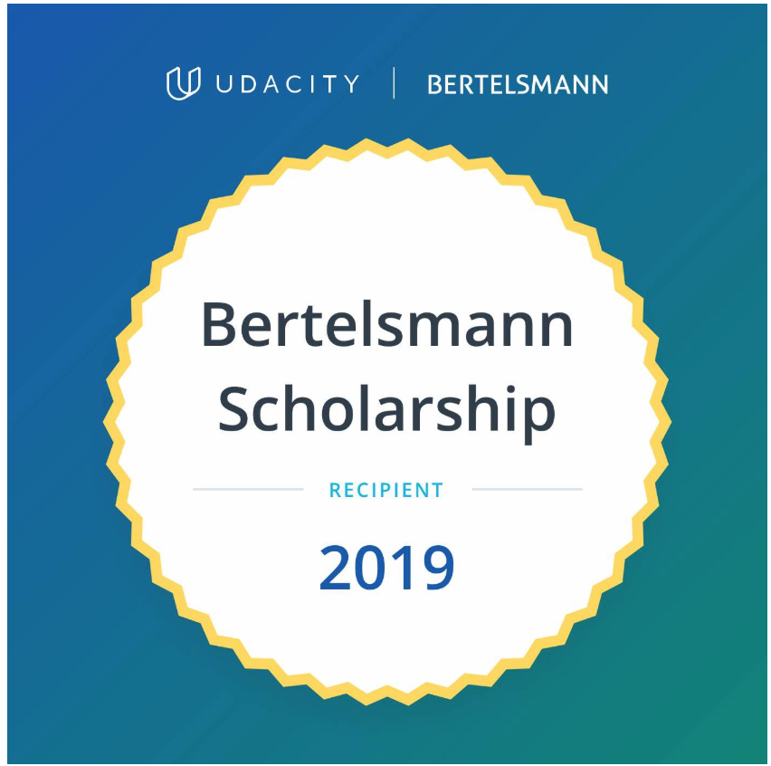

# Udacity Bertelsmann Technical Scholarship Cloud Track Challenge Collaboration
This repo contains the team project deliverables from the cloud track challenge program.
 ---
#### _Project development is currently under way, deliverables will be added incrementally to this repo. Follow us to watch this space :sunglasses:!_

## Project Information
The team comprises of [Adrik S](https://github.com/Adriks976), [Audrey ST](https://github.com/atan4583) and [Christopher R](https://www.linkedin.com/in/christopher-rauh/). We

* plan to deliver a demo cloud DevOps model leveraging and extending on concepts we learned from the cloud track challenge program.

* are building an automated deployment pipeline to deploy a sentiment prediction classifier app to AWS cloud leveraging Serverless Framework, AWS Lambda, Amazon API Gateway, DynamoDB, S3 Bucket, Elastic Load Balancing, ECS and ECR services.

### About Automated Deployment Pipeline

> * construction in progress...
>
>
> *
>

 ---
### About Sentiment Prediction Classifier App
> * construction in progress...
>
>
> *
>
 ---
 ### About Cloud DevOps Model Built on Serverless Framework and AWS Services
 > * construction in progress...
 >
 >
 > *
 >
  ---
