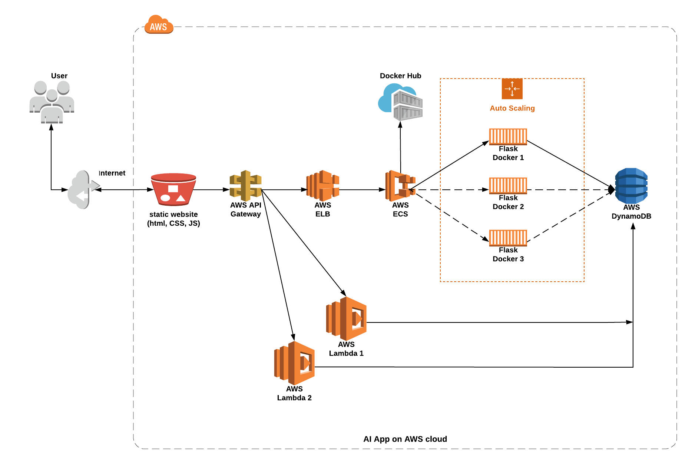
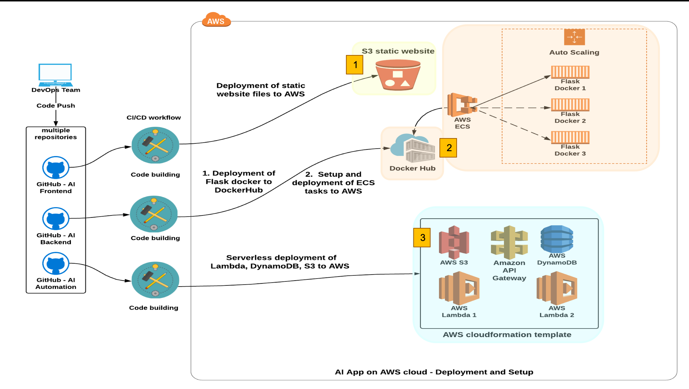
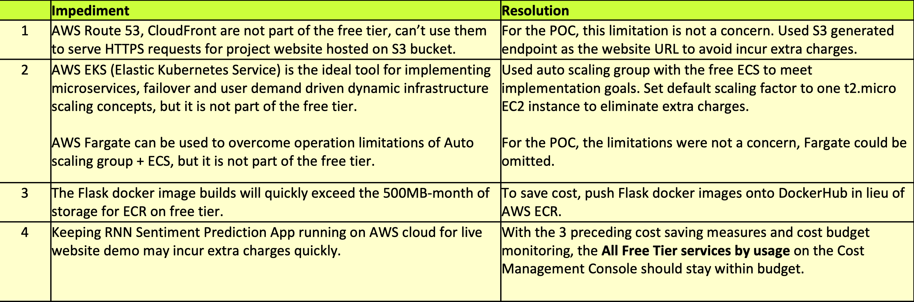

# Udacity Bertelsmann Technical Scholarship Cloud Track Challenge Project - Deploy An AI Sentiment Prediction App to AWS Cloud
This repo is the project page of the 3 project repos and contains information about the project.
 ---
#### _The project was created by 3 scholars from the Cloud Track Challenge_

## Project Website: :star2: **[AI Sentiment Prediction App on AWS](http://ai-frontend.s3-website-us-west-2.amazonaws.com/)** :star2:
#### For cost saving, only **_1_** instance of AI prediction engine is up for demo, though scaling up to **_3_**  instances is feasible

## Presentation: view this page or [Google Drive (PowerPoint)](https://drive.google.com/file/d/1nfianScb00vW7owKBzpQHafxhsjp4IdJ/view?usp=sharing) or [Github (PDF)](https://github.com/bertelsmann-cloud-challenge-collaborate/ai-projpage/blob/master/AIAppOnAWS.pdf)

## AI Sentiment Prediction App on AWS infrastructure

## Project Artifact Repositories

The project has 3 code and artifact repositories:
### [ai-frontend](https://github.com/bertelsmann-cloud-challenge-collaborate/ai-frontend)
> * this repo contains the project website static files **_index.html_** and **_app.js_**
>
> * the files reside in the **_static_** folder, any changes pushed onto the master branch will trigger the GitHub CI/CD Action on the repo to copy the static files to the S3 bucket hosting the project website on AWS

### [ai-automation](https://github.com/bertelsmann-cloud-challenge-collaborate/ai-automation)
> * this repo contains the Serverless Framework configuration file **_serverless.yml_** and Lambda function code files for deployment of Lambda functions, their triggering events and required infrastructure resources (DynamoDB, API Gateway and S3) to AWS
>
> * any changes pushed to the master branch will trigger the Github CI/CD Action on the repo to start serverless deployment of the changes to AWS
>
>
### [ai-backend](https://github.com/bertelsmann-cloud-challenge-collaborate/ai-backend)
> * this repo contains the code files for building and pushing a Flask docker image to ECR, then deploying a new task definition to ECS
>
> * any changes pushed to the master branch will trigger the Github CI/CD Action on the repo to apply and deploy the changes to AWS

## How to use AI Sentiment Prediction App
### Scenario I

> 1. User enters a text in the web UI and click **Submit** button to get a sentiment prediction result
>
> 2. The RNN model returns a label (e.g. guilt) representing the predicted sentiment, which user can approve or revise
>

> 3. User clicks **Approve** button to accept the prediction result. The result is recorded to the DynamoDB
>
  ---
### Scenario II

> 1. The RNN model prediction result returned does not quite match the user’s expectation. The user can click one of the seven available labels to override the returned result
>

> 2. User clicks **‘joy’** label to override the returned result **‘sadness’**. The revised result is recorded to the DynamoDB
>
 ---
### Scenario III

> 1. All previously approved and revised prediction results are stored in the DynamoDB. The data can be exported to a csv file from the Web UI as a new dataset for retraining the RNN Sentiment Prediction model
>

> 2. User accesses the csv file **[download endpoint](https://gvvik49go8.execute-api.us-west-2.amazonaws.com/prod/getcsv)** to download prediction results stored in the DynamoDB. This csv file can then be used as a new dataset for retraining the RNN Sentiment Prediction model
>
>
## Project Information
The project transforms the original infrastructure of an AI sentiment prediction app (trained on the RNN model) to an AWS cloud deployable infrastructure.

**Project Goals**: Implements various AWS cloud stack concepts covered in Phase I of Udacity | Bertelsmann Technical Scholoarship Cloud Track Challenge, i.e. S3, Lambda, Elastic Load Balancer, Auto Scaling Group, Cloudformation and IAM; as well as advanced concepts like Serverless Framework, CI/CD, Docker, API Gateway, ECS, DockerHub, DynamoDB and Microservices.

**Project Team**: an international team with 3 members from Phase I of the Cloud Track Challenge:
* [Adrik S](https://github.com/Adriks976) (France)
* [Audrey ST](https://github.com/atan4583) (USA)
* [Christopher R](https://github.com/christopherrauh) (Germany)

**Website**: :star2: **[AI Sentiment Prediction App on AWS](http://ai-frontend.s3-website-us-west-2.amazonaws.com/)** :star2:

### AI Sentiment Prediction App Original Infrastructure (Logical View)

#### The original architecture of the AI app consists of
> * a Flask app backend hosting a RNN sentiment prediction model
>
> * a website with a Vue Web UI powered by **_Springboot Framework_**
>
> * a datastore built on MySQL DB
>
> * It is styled in Microservices fashion. This makes the infrastructure and its underlying components easily transformable to AWS cloud deployable infrastructure
>
>
### AI Sentiment Prediction App Transformed Cloud Infrastructure (Logical View)

#### The transformation resulted in a streamlined infrastructure as below:
> * the Flask backend now runs in a docker container and utilizes AWS ECS
>
> * the website is now hosted on S3 bucket powered by AWS Lambda functions
>
> * the MySQL datastore is now replaced by a light weight noSQL DynamoDB
>
> The new AWS cloud infrastructure comes with these benefits:
> * costly specialist support effort in  Springboot, MySQL, Infrastructure resource deployment & provisioning no longer needed
>
> * built-in auto failover and user demand driven infrastructure scaling features
>
> * predictable operation performance with minimum effort and improved overall user experience
>
>
### AI Sentiment Prediction App on AWS Cloud Infrastructure (Physical Implementation)

#### Cloud Lesson Concepts Implemented
> * GitHub:  Lesson 1 - 12
>
> * AWS S3 Static Website: Lesson 14, 23
>
> * AWS Lambda function: Lesson 13
>
> * AWS Elastic Load Balancer: Lesson 16, 20
>
> * AWS Auto Scaling Group: Lesson 20
>
> * AWS Cloudformation: Lesson 19
>
> * AWS IAM: Lesson 15
>
 ---
#### Advanced Concepts Implemented
> * GitHub CI/CD workflow pipelines
>
> * AWS API Gateway
>
> * AWS ECS (elastic container service)
>
> * DockerHub (container image registry)
>
> * Flask Docker (scaling between 1 to 3 instances)
>
> * AWS DynamoDB
>
> * AWS Serverless Framework
>
> * Microservices
>
>
### Cloud Infrastruture Deployment Workflow

> * DevOps team merges feature branches to the master branch and pushes to one of the three remote masters
>
> * Code build - three build paths:
>
>   1. If the push is onto **ai-frontend** repo, CI/CD Action **_Upload Website_** automatically runs to upload updated static files (index.html, app.js) to AWS S3 website **udacity-ai-frontend**
>
>   2. If the push is onto **ai-backend** repo, CI/CD Action **_Deploy to Amazon ECS_** automatically runs to build a new Flask container to push to the DockerHub, then deploys a new ECS task definition to start container operation on AWS cloud
>
>   3. If the push is onto **ai-automation** repo, CI/CD Action automatically runs a serverless.yml configuration file to deploy Lambda functions, their triggering events and required infrastructure resources (DynamoDB, API Gateway and S3) to AWS and rebuild the website
>
>
### Cloud Infrastruture Operation Workflow

> * RNN Sentiment Prediction App Operation
>
>   a. User submits a sentiment prediction request thru website UI and receives a result
>
>        - User approves the prediction result, the approved result is written to the DynamoDB
>
>        - User revises the prediction result, the revised result is written to the DynamoDB
>
>   b. User downloads prediction results stored in the DynamoDB as a CSV file for use as a new dataset for retraining of the RNN model
>
>   c. Depending on website traffic, AWS ECS and Auto Scaling group orchestrate to scale up to 3 Flask container instances to optimize workload distribution and app response time
>
>
### Implementation Impediments and Resolutions
This is a POC (proof of concept) project the project team put together to implement and practice basic cloud DevOps concepts from this phase I Challenge and experiment advanced concepts nominated by team members.

The project was 100% unfunded and utilized AWS free-tier account to conduct the POC. The impediments experienced during the implementation and resolutions are listed below:

>
>
### Free Tier Budget Analysis and Usage Forecast

> The All Free Tier services by usage report on the Cost Management Console shows ECR is the largest consumer of the free tier budget. With DockerHub in its place, ECR will stop burning the budget. The **[AI Sentiment Prediction App on AWS](http://ai-frontend.s3-website-us-west-2.amazonaws.com/)** cloud can now stay on for live demo purpose
>
>
